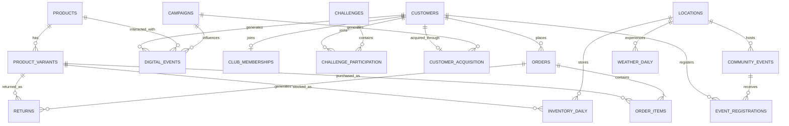

# Terra Active — Data Model

## Objective

This document defines the relational data model required to answer Terra Active's priority business questions and calculate the KPI framework defined in `03_KPIs.md`.

The model is designed from **analytical requirements first**. Tables and fields are included because they support a defined business question, KPI, data-quality requirement, or relationship.

The final environment will combine:

* Synthetic customer and commercial data
* Synthetic digital behavioural data
* Synthetic community and loyalty data
* External weather data
* Potential public datasets used to calibrate realistic distributions and behaviours

---

## 1. Design Principles

The data model follows several principles:

1. **Every table has a defined grain.**
   Each row should represent one clearly defined business event or entity.

2. **Primary and foreign keys preserve relational integrity.**
   Transactions, customers, products, events and campaigns must connect consistently.

3. **Behaviour is recorded historically.**
   Purchases, website events, event registrations and inventory observations should not overwrite previous states.

4. **Raw and derived information remain distinguishable.**
   Variables such as CLV, purchase frequency or retention are calculated during analysis rather than stored as static customer attributes.

5. **Customer segments should not determine outcomes perfectly.**
   Segments influence behaviour probabilistically rather than dictating it.

6. **The model should support longitudinal analysis.**
   Dates and timestamps are retained so customer journeys, cohorts and pre/post-event behaviour can be reconstructed.

7. **External variables are modelled separately.**
   Weather information is stored independently and joined by location and date.

8. **Personally identifiable information is unnecessary.**
   Synthetic customer IDs are sufficient for the analytical objectives of the portfolio.

---

# 2. High-Level Data Domains

The model is divided into six analytical domains.

### Customer & Commerce

- `customers`
- `products`
- `product_variants`
- `orders`
- `order_items`
- `returns`

### Digital Product

- `digital_events`

### Community & Loyalty

- `club_memberships`
- `community_events`
- `event_registrations`
- `challenges`
- `challenge_participation`

### Marketing & Acquisition

- `campaigns`
- `customer_acquisition`

### Operations

- `locations`
- `inventory_daily`

### External Data

- `weather_daily`

---

# 3. Entity Relationship Overview



---

# 4. Core Customer & Commerce Tables

## 4.1 `customers`

### Grain

**One row per unique Terra Active customer account.**

The table contains relatively stable customer attributes known at account level. Transactional behaviour such as purchases, returns, Club membership, event attendance and digital activity is stored in separate tables.

| Column | Type | Description |
|---|---|---|
| `customer_id` | STRING | Unique customer identifier |
| `signup_date` | DATE | Date the customer created a Terra Active account |
| `location_id` | STRING | Customer's primary Terra Active geographic market |
| `age_band` | STRING | Broad customer age group |
| `gender` | STRING | Synthetic customer gender category |
| `customer_persona` | STRING | Synthetic lifestyle/persona segment |
| `preferred_sport` | STRING | Primary activity preference |
| `marketing_consent` | BOOLEAN | Whether the customer accepts marketing communications |

### Relationship

`customers.location_id` → `locations.location_id`

### Example customer persona

* Active Lifestyle
* Outdoor Explorer
* Performance Athlete
* Studio Regular
* Urban Runner


### Modelling Principle

Customer personas influence preferences probabilistically but do not directly determine commercial outcomes such as purchase frequency, retention or customer lifetime value.

Metrics such as CLV, repeat purchasing and engagement are derived later from behavioural tables rather than stored in the customer master.

---

## 4.2 `products`

### Grain

**One row per product style.**

A product represents a distinct Terra Active design rather than an individual colour-size SKU. Sellable variants are stored separately in `product_variants`.

| Column | Type | Description |
|---|---|---|
| `product_id` | STRING | Unique product style identifier |
| `product_name` | STRING | Product style name |
| `category` | STRING | Apparel or Accessory |
| `subcategory` | STRING | T-shirt, leggings, running jacket, cap, backpack, etc. |
| `sport_positioning` | STRING | Running, hiking, Pilates, multi-sport, lifestyle, etc. |
| `gender_positioning` | STRING | Women's, men's or unisex |
| `collection` | STRING | Core or seasonal collection |
| `launch_date` | DATE | Product style launch date |
| `list_price` | DECIMAL | Standard retail price |
| `unit_cost` | DECIMAL | Synthetic cost of goods sold |
| `technical_level` | STRING | Lifestyle, performance or technical |
| `waterproof` | BOOLEAN | Whether the product style is waterproof |
| `insulated` | BOOLEAN | Whether the product style provides insulation |
| `sustainable_material_pct` | DECIMAL | Percentage of sustainable/recycled materials |

### Why these attributes exist

They allow analyses such as:

- Revenue vs profitability
- Product performance by category and subcategory
- Sustainability preference
- Weather sensitivity
- New collection performance
- Accessory cross-selling
- Performance vs lifestyle positioning
- Technical vs lifestyle product performance

---

## 4.3 `product_variants`

### Grain

**One row per sellable colour-size SKU.**

Each product style can be sold in multiple colours and sizes. `product_variants` therefore represents the individual SKUs that customers can purchase and that Terra Active must manage in inventory.

| Column | Type | Description |
|---|---|---|
| `sku_id` | STRING | Unique sellable SKU identifier |
| `product_id` | STRING | Parent product style identifier |
| `colour_family` | STRING | Simplified colour group |
| `size` | STRING | Product size or `ONE_SIZE` where applicable |
| `active_flag` | BOOLEAN | Whether the SKU is currently available for sale |

### Relationships

- `product_variants.product_id` → `products.product_id`
- One product style can have multiple product variants.
- Each `sku_id` represents a unique product-colour-size combination.

### Why these attributes exist

Separating product styles from sellable SKUs allows analyses such as:

- Colour preference within and across product styles
- Size-level demand patterns
- SKU-level sales performance
- Size and colour availability
- Stockout analysis
- Inventory planning by colour and size
- Return rates by size or colour
- Identification of overstocked and understocked variants

Future transactional and inventory tables should reference `sku_id` where the analysis requires the exact item purchased or stocked.

---

## 4.4 `orders`

### Grain

**One row per completed or attempted customer order.**

The table represents the order-level transaction or checkout attempt. Product-level quantities, prices, discounts, costs and revenue are stored separately in `order_items`.

| Column | Type | Description |
|---|---|---|
| `order_id` | STRING | Unique order identifier |
| `customer_id` | STRING | Customer placing the order |
| `order_timestamp` | TIMESTAMP | Order creation timestamp |
| `sales_channel` | STRING | Commerce platform used: Website, iOS or Android |
| `device` | STRING | Device used: Mobile, Desktop or Tablet |
| `currency` | STRING | Transaction currency determined by shipping market |
| `shipping_location_id` | STRING | Terra Active location representing the delivery market |
| `order_status` | STRING | Terminal order status: Completed, Cancelled or Refunded |
| `promotion_code` | STRING | Promotion code associated with the order where applicable |
| `campaign_id` | STRING | Marketing campaign attributed to the order where available |
| `shipping_fee` | DECIMAL | Shipping charge applied to the order; populated after basket generation |

### Foreign Keys

- `orders.customer_id` → `customers.customer_id`
- `orders.shipping_location_id` → `locations.location_id`
- `orders.campaign_id` → `campaigns.campaign_id`

`campaign_id` is nullable because order-level campaign attribution is intentionally incomplete.

### Shipping Geography

Customer home location and order shipping location are separate concepts:

```text
customers.location_id
        ↓
customer home market

orders.shipping_location_id
        ↓
delivery market for a specific order
```

Orders may be shipped to the customer's home location or another Terra Active location within the same country.

City and country are not duplicated directly on `orders`. They are recovered by joining:

```text
orders.shipping_location_id
        ↓
locations.location_id
        ↓
city / country
```

This keeps `locations` as the geographic master dimension and avoids inconsistent location values across transactional, inventory, weather and community datasets.

### Currency

`currency` remains stored directly on the order because it is a transaction-level property.

The generated currency is consistent with the shipping market:

```text
United Kingdom → GBP
Switzerland    → CHF
France         → EUR
Germany        → EUR
Netherlands    → EUR
Spain          → EUR
Italy          → EUR
```

### Order Status Semantics

`order_status` represents the terminal order-level state.

Possible values:

- `Completed` — successfully fulfilled and not fully refunded
- `Cancelled` — order created but cancelled before fulfilment
- `Refunded` — fulfilled order that was subsequently fully refunded

Partial product returns are not represented by setting the whole order to `Refunded`. They are modelled separately in `returns`.

This distinction prevents order-level status from duplicating item-level return behaviour.

### Promotion Attribution

`promotion_code` records the promotional mechanism associated with the order.

Current synthetic promotion codes include:

- `WELCOME10`
- `CLUB15`
- `SEASON20`
- `EVENT10`
- `FREESHIP`

Promotion attribution is nullable because most orders do not use a promotion.

`WELCOME10` is restricted to a customer's first order.

Cancelled orders currently do not retain a promotion code in the synthetic generation logic.

The existence of a promotion code does not independently determine order revenue. Monetary discount amounts are stored at line level in `order_items`.

### Campaign Attribution

`campaign_id` represents direct order-level marketing attribution where a campaign can reasonably be linked to the order.

Campaign attribution is intentionally incomplete.

An attributed campaign must:

- Exist in `campaigns`
- Be active on the order date
- Match the customer's target segment
- Respect marketing consent for Email campaigns

A customer's acquisition campaign is not automatically reused on later orders.

If the acquisition campaign is still eligible when the customer's first order occurs, it has an increased probability of receiving first-order attribution.

This allows the project to distinguish:

```text
customer acquisition attribution
            ≠
order conversion attribution
```

and supports downstream campaign performance analysis without assuming perfect marketing attribution.

### Shipping Fee

`shipping_fee` is intentionally populated only after `order_items` has been generated.

Shipping charges may depend on:

- Basket value
- Shipping market
- Free-shipping thresholds
- `FREESHIP` promotion usage

Generating shipping fees before knowing basket value would create avoidable inconsistencies.

### Important Modelling Decision

Order revenue, cost and margin should be **calculated from `order_items` rather than independently generated on `orders`.**

This avoids inconsistencies between:

- Item-level sales
- Order-level sales
- Discounts
- Costs
- Refunds

For example:

```text
gross_sales
    = Σ(unit_list_price × quantity)

discount_value
    = Σ(discount_amount × quantity)

net_product_revenue
    = Σ(unit_selling_price × quantity)

COGS
    = Σ(unit_cost × quantity)
```

Shipping revenue can subsequently be incorporated using `orders.shipping_fee`.

---

## 4.5 `order_items`

### Grain

**One row per SKU contained in an order.**

If multiple units of the same SKU are purchased in the same order, they are represented through `quantity` rather than duplicate rows.

This is one of the most important transactional tables in the project.

| Column | Type | Description |
|---|---|---|
| `order_item_id` | STRING | Unique order-line identifier |
| `order_id` | STRING | Parent order |
| `sku_id` | STRING | Exact colour-size product variant contained in the order |
| `quantity` | INTEGER | Number of units of the SKU |
| `unit_list_price` | DECIMAL | Standard retail price per unit at purchase |
| `discount_amount` | DECIMAL | Discount applied per unit |
| `unit_selling_price` | DECIMAL | Actual selling price per unit after discount |
| `unit_cost` | DECIMAL | Cost of goods per unit |

### Foreign Keys

- `order_items.order_id` → `orders.order_id`
- `order_items.sku_id` → `product_variants.sku_id`

Product-style information is recovered through:

```text
order_items.sku_id
        ↓
product_variants.sku_id
        ↓
product_variants.product_id
        ↓
products.product_id
```

This preserves the correct commercial grain: customers buy an exact colour-size SKU rather than an abstract product style.

### Pricing Relationship

For every order line:

```text
unit_selling_price
    =
unit_list_price
    -
discount_amount
```

`discount_amount` represents the monetary discount applied to one unit.

The order-level `promotion_code` may influence line-level discount generation, but the monetary effect remains stored at line level.

### Derived Metrics

From `order_items`, the project can calculate:

```text
line_gross_sales
    = unit_list_price × quantity

line_discount_value
    = discount_amount × quantity

line_net_revenue
    = unit_selling_price × quantity

line_COGS
    = unit_cost × quantity

line_gross_profit
    = line_net_revenue - line_COGS
```

Aggregating these metrics supports:

- Gross sales
- Net product revenue
- Discount value
- COGS
- Gross profit
- Gross margin
- Units per transaction
- Average order value
- Product and category revenue
- SKU-level sales
- Colour and size demand
- Accessory attachment
- Basket composition
- Promotion effectiveness

---

## 4.6 `returns`

### Grain

**One row per returned order item or return event.**

Returns reference the exact transactional line that was originally purchased.

| Column | Type | Description |
|---|---|---|
| `return_id` | STRING | Unique return identifier |
| `order_item_id` | STRING | Original purchased order line |
| `order_id` | STRING | Original order |
| `sku_id` | STRING | Exact returned product variant |
| `return_date` | DATE | Date the return was recorded |
| `return_reason` | STRING | Reason for return |
| `return_quantity` | INTEGER | Number of units returned |
| `refund_amount` | DECIMAL | Monetary amount refunded |
| `return_condition` | STRING | Resellable, damaged, etc. |

### Foreign Keys

- `returns.order_item_id` → `order_items.order_item_id`
- `returns.order_id` → `orders.order_id`
- `returns.sku_id` → `product_variants.sku_id`

### Relationship with Order Status

The `returns` table captures item-level return activity.

A `Completed` order may therefore contain one or more partial returns while remaining `Completed` at order level.

An order with `order_status = 'Refunded'` represents a fully refunded order and should ultimately have return records consistent with that terminal state.

This relationship should be enforced during returns generation and validation to avoid contradictory refund information.

### Example Return Reasons

- Size / fit
- Changed mind
- Product appearance
- Quality issue
- Damaged
- Incorrect item
- Late delivery

### Analytical Use

Supports:

- Unit return rate
- Return value rate
- Product and SKU return analysis
- Size-level return analysis
- Colour-level return analysis
- Customer return behaviour
- Impact of discounting on returns
- Product attribute analysis
- Net revenue after returns

---

# 5. Digital Product Data

## 5.1 `digital_events`

### Grain

**One row per customer or anonymous digital interaction.**

This is the core Product Analytics event table.

| Column               | Type      | Description                                           |
| -------------------- | --------- | ----------------------------------------------------- |
| `event_id`           | STRING    | Unique event identifier                               |
| `event_timestamp`    | TIMESTAMP | Time of event                                         |
| `customer_id`        | STRING    | Customer identifier when known                        |
| `anonymous_user_id`  | STRING    | Anonymous browser/app identifier                      |
| `session_id`         | STRING    | Digital session identifier                            |
| `event_name`         | STRING    | Type of interaction                                   |
| `platform`           | STRING    | Website, iOS, Android                                 |
| `device_type`        | STRING    | Mobile, desktop, tablet                               |
| `product_id`         | STRING    | Product involved, where applicable                    |
| `sku_id`             | STRING    | Specific colour-size SKU involved, where applicable   |
| `event_id_reference` | STRING    | Community event involved, where applicable            |
| `campaign_id`        | STRING    | Marketing campaign attribution where applicable       |
| `page_type`          | STRING    | Product, checkout, home, events, etc.                 |
| `traffic_source`     | STRING    | Organic, paid search, social, email, direct, referral |
| `country`            | STRING    | Geographic location of interaction                    |

### Example `event_name` values

```text
session_start
page_view
view_product
search
add_to_favourites
add_to_cart
remove_from_cart
begin_checkout
purchase
view_event
register_event
view_challenge
join_challenge
view_recommendation
click_recommendation
app_open
```

### Analytical use

Supports:

* Purchase funnels
* Conversion analysis
* Session behaviour
* App engagement
* Feature adoption
* Recommendation performance
* Customer journeys
* Marketing attribution

### Important modelling principle

A customer journey is **not stored directly**.

It is reconstructed chronologically from event-level data.

---

# 6. Terra Active Club & Community

## 6.1 `club_memberships`

### Grain

**One row per Terra Active Club membership.**

| Column              | Type    | Description                  |
| ------------------- | ------- | ---------------------------- |
| `membership_id`     | STRING  | Unique membership identifier |
| `customer_id`       | STRING  | Club member                  |
| `join_date`         | DATE    | Club joining date            |
| `membership_status` | STRING  | Active, inactive             |
| `points_balance`    | INTEGER | Current point balance        |
| `membership_tier`   | STRING  | Optional loyalty tier        |
| `referral_source`   | STRING  | How member joined Club       |

### Important analytical consideration

Club membership should be treated as a **time-dependent event**.

When analysing whether Club members are more valuable, behaviour **before and after `join_date`** should be compared rather than simply comparing members with non-members.

---

## 6.2 `community_events`

### Grain

**One row per Terra Active community event.**

| Column              | Type    | Description                                  |
| ------------------- | ------- | -------------------------------------------- |
| `event_id`          | STRING  | Unique event identifier                      |
| `event_name`        | STRING  | Event title                                  |
| `event_type`        | STRING  | Running, trail, hiking, Pilates, etc.        |
| `event_date`        | DATE    | Event date                                   |
| `start_time`        | TIME    | Event starting time                          |
| `location_id`       | STRING  | Event location                               |
| `difficulty_level`  | STRING  | Beginner, intermediate, advanced             |
| `capacity`          | INTEGER | Maximum participants                         |
| `event_price`       | DECIMAL | Registration cost                            |
| `club_only`         | BOOLEAN | Whether event is restricted to Club members  |
| `weather_sensitive` | BOOLEAN | Whether weather materially affects the event |
| `cancelled`         | BOOLEAN | Event cancellation indicator                 |

---

## 6.3 `event_registrations`

### Grain

**One row per customer-event registration.**

| Column                   | Type      | Description                        |
| ------------------------ | --------- | ---------------------------------- |
| `registration_id`        | STRING    | Unique registration                |
| `event_id`               | STRING    | Registered event                   |
| `customer_id`            | STRING    | Registered customer                |
| `registration_timestamp` | TIMESTAMP | Registration time                  |
| `attendance_status`      | STRING    | Attended, no-show, cancelled       |
| `cancellation_timestamp` | TIMESTAMP | Cancellation time where applicable |
| `feedback_score`         | INTEGER   | Post-event rating                  |
| `points_earned`          | INTEGER   | Terra Club points earned           |

### Foreign Keys

`event_id → community_events.event_id`

`customer_id → customers.customer_id`

### Analytical use

Supports:

* Registration rate
* Attendance rate
* Repeat event participation
* Event type comparisons
* Pre/post-event purchase analysis
* Geography analysis
* Weather impact on attendance

---

# 7. Challenges

## 7.1 `challenges`

### Grain

**One row per Terra Active challenge.**

| Column           | Type    | Description                               |
| ---------------- | ------- | ----------------------------------------- |
| `challenge_id`   | STRING  | Unique challenge identifier               |
| `challenge_name` | STRING  | Challenge title                           |
| `challenge_type` | STRING  | Running, movement, hiking, wellness, etc. |
| `start_date`     | DATE    | Challenge start                           |
| `end_date`       | DATE    | Challenge end                             |
| `target_value`   | DECIMAL | Completion target                         |
| `target_unit`    | STRING  | Kilometres, sessions, days, etc.          |
| `points_reward`  | INTEGER | Club points awarded                       |

---

## 7.2 `challenge_participation`

### Grain

**One row per customer-challenge participation.**

| Column              | Type    | Description                  |
| ------------------- | ------- | ---------------------------- |
| `participation_id`  | STRING  | Unique participation         |
| `challenge_id`      | STRING  | Challenge                    |
| `customer_id`       | STRING  | Participant                  |
| `join_date`         | DATE    | Participation start          |
| `completion_status` | STRING  | Completed, active, abandoned |
| `completion_date`   | DATE    | Completion date              |
| `progress_value`    | DECIMAL | Progress toward target       |

### Analytical use

Supports:

* Challenge adoption
* Challenge completion
* Digital engagement
* Relationship between challenges and retention

---

# 8. Marketing & Acquisition

## 8.1 `campaigns`

### Grain

**One row per marketing campaign.**

| Column           | Type    | Description                                   |
| ---------------- | ------- | --------------------------------------------- |
| `campaign_id`    | STRING  | Unique campaign                               |
| `campaign_name`  | STRING  | Campaign title                                |
| `channel`        | STRING  | Instagram, TikTok, paid search, email, etc.   |
| `campaign_type`  | STRING  | Acquisition, product launch, event, retention |
| `start_date`     | DATE    | Campaign start                                |
| `end_date`       | DATE    | Campaign end                                  |
| `target_segment` | STRING  | Intended audience                             |
| `campaign_spend` | DECIMAL | Marketing spend                               |
| `impressions`    | INTEGER | Advertising impressions                       |
| `clicks`         | INTEGER | Campaign clicks                               |

### Modelling Principle

Campaigns are generated before `customer_acquisition` so that paid, influencer and event-driven acquisitions can reference valid campaign IDs and preserve referential integrity.

### Analytical use

Supports:

* CAC
* ROAS
* Campaign conversion
* Campaign comparisons
* Segment effectiveness

---

## 8.2 `customer_acquisition`

### Grain

**One row per acquired customer.**

This table records how each customer initially entered the Terra Active ecosystem.

| Column | Type | Description |
|---|---|---|
| `customer_id` | STRING | Acquired customer |
| `acquisition_date` | DATE | Date the customer entered the Terra Active ecosystem |
| `acquisition_channel` | STRING | Primary acquisition channel |
| `campaign_id` | STRING | Campaign associated with acquisition, where applicable |
| `first_touch_channel` | STRING | First known marketing interaction |
| `last_touch_channel` | STRING | Final known interaction before account creation |
| `acquisition_device` | STRING | Device used during acquisition |
| `acquisition_platform` | STRING | Website, iOS or Android |
| `referral_flag` | BOOLEAN | Whether acquisition occurred through customer referral |

### Relationships

- `customer_id` → `customers.customer_id`
- `campaign_id` → `campaigns.campaign_id` where applicable

### Modelling Principles

- Each customer has at most one primary acquisition record.
- For the initial synthetic version, `acquisition_date` is aligned with `customers.signup_date`.
- Acquisition channel remains fixed after initial acquisition.
- Later marketing interactions are represented separately.
- Channel may influence downstream behaviour probabilistically but does not directly determine retention or CLV.
- `referral_flag` is derived from `acquisition_channel` rather than generated independently.

### Analytical Use

Supports:

- Acquisition volume by channel
- Customer acquisition cost
- CLV by acquisition source
- Retention by acquisition source
- First-touch vs last-touch attribution
- Referral effectiveness
- Device/platform differences during acquisition

---

# 9. Locations

## 9.1 `locations`

### Grain

**One row per Terra Active operational or analytical location.**

| Column          | Type    | Description                         |
| --------------- | ------- | ----------------------------------- |
| `location_id`   | STRING  | Unique location identifier          |
| `city`          | STRING  | City                                |
| `country`       | STRING  | Country                             |
| `latitude`      | DECIMAL | Latitude                            |
| `longitude`     | DECIMAL | Longitude                           |
| `location_type` | STRING  | Market, warehouse, store, event hub |
| `region`        | STRING  | Broader geographic region           |

### Purpose

A separate location table allows us to consistently connect:

* Events
* Inventory
* Weather
* Geographic demand

without repeatedly storing inconsistent city names.

---

# 10. Inventory

## 10.1 `inventory_daily`

### Grain

**One row per SKU-location-date combination.**

Inventory is managed at sellable SKU level because stock availability can differ by colour and size even when the parent product style remains available.

For example:

```text
SKU000342
London
2025-05-12
```

---

# 11. Weather

## 11.1 `weather_daily`

### Grain

**One row per location per calendar date.**

This table is expected to be populated from an external weather API where possible.

| Column               | Type    | Description                    |
| -------------------- | ------- | ------------------------------ |
| `weather_date`       | DATE    | Calendar date                  |
| `location_id`        | STRING  | Geographic location            |
| `mean_temperature_c` | DECIMAL | Mean daily temperature         |
| `min_temperature_c`  | DECIMAL | Minimum temperature            |
| `max_temperature_c`  | DECIMAL | Maximum temperature            |
| `precipitation_mm`   | DECIMAL | Daily precipitation            |
| `wind_speed_kmh`     | DECIMAL | Mean/max wind measure          |
| `sunshine_hours`     | DECIMAL | Sunshine duration              |
| `weather_code`       | STRING  | Standardised weather condition |

### Engineered features

The raw weather table should retain observed variables.

Derived variables can later include:

```text
RAINY_DAY
HEAVY_RAIN
HOT_DAY
COLD_DAY
TEMPERATURE_BAND
WEATHER_SEVERITY
```

These belong in the **feature-engineering layer**, not necessarily in the raw weather table.

---

# 12. Primary and Foreign Key Summary

| Table | Primary Key | Important Foreign Keys |
|---|---|---|
| `customers` | `customer_id` | `location_id` |
| `products` | `product_id` | — |
| `product_variants` | `sku_id` | `product_id` |
| `orders` | `order_id` | `customer_id` |
| `order_items` | `order_item_id` | `order_id`, `sku_id` |
| `returns` | `return_id` | `order_item_id`, `order_id`, `sku_id` |
| `digital_events` | `event_id` | `customer_id`, `product_id`, `sku_id`, `campaign_id` |
| `club_memberships` | `membership_id` | `customer_id` |
| `community_events` | `event_id` | `location_id` |
| `event_registrations` | `registration_id` | `event_id`, `customer_id` |
| `challenges` | `challenge_id` | — |
| `challenge_participation` | `participation_id` | `challenge_id`, `customer_id` |
| `campaigns` | `campaign_id` | — |
| `customer_acquisition` | `customer_id` | `campaign_id` |
| `locations` | `location_id` | — |
| `inventory_daily` | Composite | `sku_id`, `location_id` |
| `weather_daily` | Composite | `location_id` |

### Composite Keys

For `inventory_daily`:

```text
(sku_id, location_id, inventory_date)
```
should be unique.

For `weather_daily`:

```text
(location_id, weather_date)
```
should be unique.

---

# 13. Example Customer Journey Across the Model

The relational structure allows a customer journey to be reconstructed across multiple tables.

Example:

```text
Instagram Campaign
        ↓
customer_acquisition
        ↓
Customer creates account
        ↓
customers
        ↓
App session
        ↓
digital_events
        ↓
Views running jacket
        ↓
digital_events
        ↓
Adds jacket + cap to cart
        ↓
digital_events
        ↓
Purchases
        ↓
orders + order_items
        ↓
Joins Terra Active Club
        ↓
club_memberships
        ↓
Registers for London community run
        ↓
event_registrations
        ↓
Attends event
        ↓
event_registrations
        ↓
Purchases running vest 12 days later
        ↓
orders + order_items
        ↓
Completes Autumn Running Challenge
        ↓
challenge_participation
```

No single table contains the complete customer journey.

The journey is reconstructed through:

```text
customer_id + timestamps + business events
```

This is intentional and reflects an event-driven analytical environment.

---

# 14. Mapping the Data Model to Priority Business Questions

| Business Question                                                  | Primary Tables Required                                                                                       |
| ------------------------------------------------------------------ | ------------------------------------------------------------------------------------------------------------- |
| What distinguishes repeat customers from one-time customers?       | `customers`, `orders`, `order_items`                                                                          |
| Which customer segments generate the highest CLV?                  | `customers`, `orders`, `order_items`, `returns`                                                               |
| What behaviours are associated with retention?                     | `customers`, `orders`, `digital_events`, `club_memberships`, `event_registrations`, `challenge_participation` |
| Which products drive revenue vs profitability?                     | `products`, `product_variants`, `orders`, `order_items`, `returns`                                            |
| Where are the strongest accessory cross-selling opportunities?     | `orders`, `order_items`, `product_variants`, `products`                                                       |
| What drives product returns?                                       | `returns`, `order_items`, `product_variants`, `products`, `customers`                                         |
| Where does the digital purchase funnel lose customers?             | `digital_events`                                                                                              |
| Which app behaviours are associated with conversion and retention? | `digital_events`, `orders`, `customers`                                                                       |
| Is event participation associated with subsequent spending?        | `event_registrations`, `orders`, `order_items`, `customers`                                                   |
| Which cities/event types should Terra Active invest in?            | `community_events`, `event_registrations`, `locations`, `customers`, `orders`                                 |
| Which acquisition channels generate the highest-value customers?   | `customer_acquisition`, `campaigns`, `customers`, `orders`, `order_items`, `returns`                           |
| How does weather affect product demand?                             | `weather_daily`, `inventory_daily`, `order_items`, `product_variants`, `products`, `locations`                 |
| Can weather improve inventory planning?                             | `weather_daily`, `inventory_daily`, `product_variants`, `products`, `locations`                               |
| What is the impact of stockouts?                                   | `inventory_daily`, `product_variants`, `products`, `orders`, `order_items`, `digital_events`                   |

---

# 15. Raw Data vs Analytical Features

The source tables should contain primarily **observable or generated business events**.

Examples of raw fields:

```text
order_timestamp
product_id
price
event_registration
rainfall
inventory_level
product_view
```

Metrics such as the following should be calculated downstream:

```text
CLV
AOV
repeat_purchase_rate
customer_tenure
days_to_second_purchase
post_event_revenue
accessory_attachment_rate
weather_sensitivity
retention_status
engagement_score
```

This prevents derived metrics from becoming stale and keeps the analytical logic reproducible.

---

# 16. Proposed Analytical Layers

The eventual project architecture will use three broad data layers.

## Raw

Data as generated or received from a source.

```text
data/raw/
```

Examples:

* Weather API responses
* Generated ecommerce events
* Generated transactions

Raw data should remain unchanged whenever practical.

---

## Processed

Cleaned, validated and standardised data.

```text
data/processed/
```

Examples:

* Standardised dates
* Valid customer/product IDs
* Deduplicated records
* Clean categories
* Valid prices
* Referential integrity checks

---

## Analytical

Business-ready datasets or SQL views created for specific analyses.

Examples:

```text
customer_360
monthly_customer_metrics
product_performance
digital_funnel
event_performance
campaign_performance
inventory_weather_daily
```

These datasets will be created later using SQL and Python.

---

# 17. Data Quality Rules

The project should eventually validate at least the following:

### Referential Integrity

* Every `customers.location_id` exists in `locations`
* Every `product_variants.product_id` exists in `products`
* Every `orders.customer_id` exists in `customers`
* Every `order_items.order_id` exists in `orders`
* Every `order_items.sku_id` exists in `product_variants`
* Every `returns.order_item_id` exists in `order_items`
* Every `returns.sku_id` exists in `product_variants`
* Every `inventory_daily.sku_id` exists in `product_variants`
* Every `inventory_daily.location_id` exists in `locations`
* Every `customer_acquisition.customer_id` exists in `customers`
* Every non-null `customer_acquisition.campaign_id` exists in `campaigns`
* Every registration links to a valid customer and event

### Transaction Logic

* Quantity must be greater than zero
* Selling price cannot be negative
* Discount cannot exceed the product's list price
* Refund cannot exceed original purchase value

### Temporal Logic

* Return date cannot precede purchase date
* Club join date cannot precede customer signup
* Event registration cannot occur after the event has already occurred
* Challenge completion cannot precede challenge join date

### Inventory Logic

* Inventory cannot normally become negative
* Closing inventory must reconcile with stock movements

### Event Logic

* Attendance should generally require registration
* Attendance cannot exceed event capacity without an explicit exception

### Customer Logic

* First purchase cannot occur before signup
* Marketing acquisition should not occur after the customer's first purchase

### Acquisition Logic

* Each customer has at most one acquisition record
* `acquisition_date` cannot occur after `signup_date` in the initial model
* `referral_flag = TRUE` only when `acquisition_channel = Referral`
* Campaign-linked acquisitions must occur during the associated campaign period

---

# 18. Data Source Strategy


| Domain              | Proposed Source                                               |
| ------------------- | ------------------------------------------------------------- |
| Customers           | Synthetic                                                     |
| Products            | Synthetic                                                     |
| Orders              | Synthetic, calibrated using realistic ecommerce distributions |
| Order Items         | Synthetic                                                     |
| Returns             | Synthetic                                                     |
| Digital Events      | Synthetic, informed by GA4 ecommerce event structures         |
| Club Memberships    | Synthetic                                                     |
| Community Events    | Synthetic                                                     |
| Event Registrations | Synthetic                                                     |
| Challenges          | Synthetic                                                     |
| Marketing           | Synthetic                                                     |
| Inventory           | Synthetic                                                     |
| Locations           | Manually defined European locations                           |
| Weather             | External historical weather API                               |

Public datasets may later be used to calibrate distributions such as:

* Basket sizes
* Repeat purchase behaviour
* Order frequency
* Conversion rates
* Seasonal patterns

The final Terra Active ecosystem remains fictional and should not be presented as representing any real company.

---

# 19. Current Status

**Status: Reference and Customer Master Data Generation In Progress**

### Completed

- Project definition
- Business questions
- KPI framework
- Initial relational data model
- Synthetic data strategy
- Location generation and validation
- Product-style generation and validation
- Product-variant / SKU generation and validation
- Customer master generation and validation

### Current Phase

The project is now moving from reference/master data into behavioural and marketing data generation.

### Next Steps

1. Generate `campaigns`
2. Validate campaign structure and timing
3. Generate `customer_acquisition`
4. Validate acquisition channel, campaign and device distributions
5. Generate Terra Active Club memberships
6. Generate orders and order items
7. Generate returns
8. Generate digital behavioural events
9. Generate community events and registrations
10. Integrate weather and inventory data

Transactional and behavioural generation should continue to preserve the core principle that relationships are probabilistic rather than deterministic.